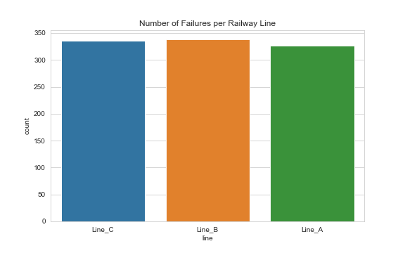
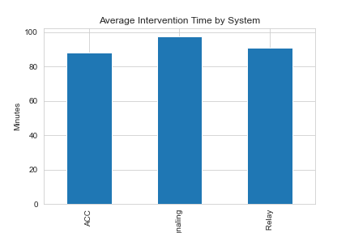

# Railway Signaling Failure Analysis

# Railway Signaling Failure Analysis

## Project Overview

This project simulates the analysis of failures in railway signaling systems using Python and pandas.

The goal is to demonstrate data analysis techniques that could support predictive maintenance and operational monitoring in railway infrastructure.

The dataset used in this project is simulated but represents realistic scenarios of signaling system failures.

---

## Project Structure

railway-signaling-failure-analysis

│
├── dat
│ └── signaling_failures.csv
│
├── notebooks
│ └── analysis.ipynb
|
├── src
│ └── data_cleaning.py
│
├── outputs
│
├── venv
│
├── requirements.txt
│
└── README.md

---

## Technologies Used

- Python
- pandas
- numpy
- matplotlib
- seaborn
- Jupyter Notebook

---

## Data Visualization

### Failures per Railway Line

### Average Intervention Time by System

---

## Main Steps of the Analysis

1. Load the dataset
2. Clean and preprocess the data
3. Compute operational KPIs
4. Identify critical stations and lines
5. Visualize failure patterns

---

## Example KPIs

## Key Performance Indicators (KPIs)

The analysis focuses on operational metrics relevant for railway signaling systems.

### Failure Count per Railway Line

Measures the number of signaling failures recorded on each railway line.  
This metric helps identify infrastructure segments with higher operational risk.

### Average Intervention Time

Calculates the mean duration of maintenance interventions grouped by signaling system type (e.g., ACC, Electronic Relay).

This KPI provides insight into:

- maintenance efficiency
- system complexity
- potential operational bottlenecks

### Critical Stations

Stations are ranked based on the number of recorded failures.

This helps identify:

- critical infrastructure nodes
- locations requiring preventive maintenance
- potential systemic reliability issues

---

## How to Run the Project

1. Clone the repository

git clone

2. Create a virtual environment

python3 -m venv venv

3. Activate the environment

Mac / Linux

source venv/bin/activate

4. Install dependencies

pip install -r requirements.txt

5. Open the notebook

notebooks/analysis.ipynb

---

## Author

Miguel Saldana

Junior Data Analyst with technical background in engineering and railway infrastructure.
